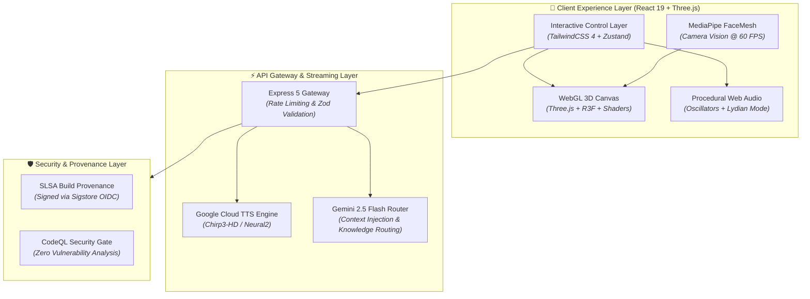

<div align="center">

# ⚡ RESONANCE 8 (ELITK-8)

[](https://github.com/mohamedosamaai/elitk-8/actions)
[](SECURITY.md)
[](https://github.com/mohamedosamaai/elitk-8/packages)
[](https://github.com/mohamedosamaai/elitk-8/attestations)
[](LICENSE)

<br/>

[](https://react.dev)
[](https://threejs.org)
[](https://developers.google.com/mediapipe)
[](https://www.typescriptlang.org)
[](https://vitejs.dev)
[](https://tailwindcss.com)
[](https://www.docker.com)

<br/>

> **High-Performance 3D WebGL Particle Engine & Multimodal AI Experience.**  
> Real-time Bernoulli lemniscate mathematics, MediaPipe 60 FPS face tracking, Web Audio synthesis, and Google Cloud APIs.

<br/>

[](https://8.elitk.com/)
[](https://github.com/mohamedosamaai/mohamedosamaai)

</div>

---

## 🎯 Architecture Overview



---

## 🚀 Key Engineering Pillars

1. **Parametric Bernoulli Lemniscate 3D Simulation**:
   - 2,000+ glowing particles generated via parametric curve mathematics:
     $$x = \frac{a \sqrt{2} \cos(t)}{\sin^2(t) + 1}, \quad y = \frac{a \sqrt{2} \sin(t) \cos(t)}{\sin^2(t) + 1}$$
   - Custom GPU shaders handling organic oscillation, contraction, and expansion responding to AI state.

2. **Real-Time Computer Vision & Landmark Tracking**:
   - Zero-latency facial tracking using `@mediapipe/face_mesh` and `@mediapipe/tasks-vision`.
   - Computes Eye Aspect Ratio (EAR) and mouth smiles to subtly modulate particle bloom and lighting at 60 FPS.

3. **Procedural Web Audio Synthesis**:
   - Built with the Web Audio API without relying on pre-recorded sound samples.
   - Dynamic real-time micro-tuning and harmonic oscillators reacting to AI conversation states.

4. **Modular Knowledge Routing & Multi-Turn Intelligence**:
   - Intelligent context routing injects only relevant domain knowledge per query, minimizing latency and token payload overhead.

5. **Supply Chain Security & SLSA Provenance**:
   - Fully signed build provenance attestations generated via Sigstore and GitHub Actions.

---

## 🛠️ Repository Directory Map

```text
elitk-8/
├── .github/
│   └── workflows/
│       ├── ci.yml                 # Build verification, typecheck, & unit tests
│       ├── codeql.yml             # Static security analysis
│       └── publish-package.yml    # Signed SLSA provenance & GitHub Packages
├── public/                        # Manifest, icons, service worker
├── src/
│   ├── knowledge/                 # Modular knowledge routing engine
│   ├── lib/                       # AI client abstraction & utilities
│   ├── types/                     # Shared TypeScript interfaces
│   ├── App.tsx                    # Core orchestrator component
│   ├── AudioEngine.ts             # Web Audio procedural synthesizer
│   ├── Resonance3D.tsx            # Three.js WebGL particle canvas
│   └── useFaceTracker.ts          # MediaPipe camera vision hook
├── tests/                         # Vitest test suite
├── server.ts                      # Express.js API gateway & TTS proxy
└── Dockerfile                     # Multi-stage production container
```

---

## ⚡ Quickstart & Local Development

### 1. Prerequisites
- **Node.js**: v20+ or v22+
- **npm**: v10+

### 2. Installation
```bash
git clone https://github.com/mohamedosamaai/elitk-8.git
cd elitk-8
npm install
```

### 3. Environment Configuration
```bash
cp .env.example .env.local
```
Add your keys in `.env.local`:
```env
PORT=3000
NODE_ENV=development
GEMINI_API_KEY=your_gemini_api_key_here
GOOGLE_TTS_API_KEY=your_google_tts_api_key_here
GCP_PROJECT_ID=your_gcp_project_id_here
```

### 4. Running the Engine
```bash
# Start fullstack dev server with Hot Module Replacement
npm run dev

# Run strict TypeScript verification
npm run typecheck

# Run test suite
npm run test

# Compile production bundle
npm run build
```

---

## 🚀 Deployment

### Google Firebase Hosting (Production)

The live site at [8.elitk.com](https://8.elitk.com) is hosted on **Google Firebase Hosting**.

```bash
# Install Firebase CLI
npm install -g firebase-tools

# Login and initialize (first time only)
firebase login
firebase init hosting

# Build and deploy
npm run build
firebase deploy --only hosting
```

### Docker (Self-hosted)

```bash
# Build production image
docker build -t elitk-8 .

# Run with environment variables
docker run -p 3000:3000 \
  -e GEMINI_API_KEY=your_key \
  -e GOOGLE_TTS_API_KEY=your_key \
  elitk-8
```

---

## 📄 License

This project is distributed under a **MIT License with Attribution Requirement**.

- ✅ Free for personal, educational, and non-commercial use
- ✅ Modification and redistribution allowed with attribution
- ❌ Commercial use requires written permission from the author
- ❌ Removing author attribution is not permitted

See [LICENSE](LICENSE) for full terms. For commercial licensing: **im@mohamedosama.me**

---

<div align="center">
  <h3>Let's Connect</h3>
  
  <p align="center">
    <a href="https://mohamedosama.me">
      
    </a>
    &nbsp;
    <a href="https://www.linkedin.com/in/mohamed-osama-ai/">
      
    </a>
    &nbsp;
    <a href="mailto:im@mohamedosama.me">
      
    </a>
  </p>

  <p><b>Mohamed Osama</b> — Systems Architect & Lead Software Engineer</p>
</div>
